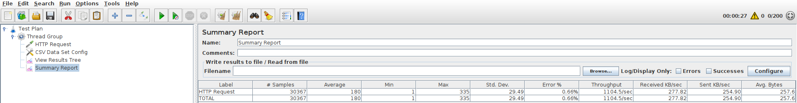
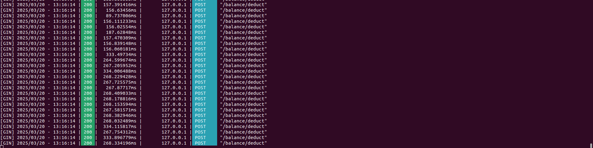

# Test-Network Hyperledger Fabric

## 1. Cài Đặt Môi Trường
Trước tiên, bạn cần cài đặt Hyperledger Fabric và các công cụ đi kèm.

### 📌 Cài đặt các yêu cầu cần thiết:
- **Docker** và **Docker Compose**
- **Go** (nếu dùng Smart Contract bằng Go)
- **Java** (nếu dùng Smart Contract bằng Java)

---

## 2. Tải Fabric Samples và Cài Đặt
```sh
git clone https://github.com/blcvn/fabric-demo.git
cd fabric-demo  
curl -sSL https://bit.ly/2ysbOFE | bash -s
export PATH=$PATH:$(pwd)/bin
export FABRIC_CFG_PATH=$(pwd)/config
echo $PATH
echo $FABRIC_CFG_PATH
```
---

## 3. Khởi Chạy Mạng Thử Nghiệm
```sh
cd test-network.
./network.sh down 
./network.sh up createChannel -ca
./network.sh deployCC -ccn basic -ccp ../asset-transfer-basic/chaincode-go -ccl go
```
## 4. Gọi API gate-way client golang
```sh
cd ../asset-transfer-basic/application-gateway-go/
Run command: go run assetTransfer.go
```
---
### 4. Test tải bằng Jmeter
```sh
Sử dụng file create_account.jmx trong folder test_jmeter để  tạo account tự động bằng jmeter.
Sử dụng file credit.jmx trong folder test_jmeter để test cộng tiền cho account.
Sử dụng file debit.jmx trong folder test_jmeter để test trừ tiền cho account.

```
--------------------------------------------------------------------
# Test tải

## I. Kịch bản test credit

### 1. Chuẩn bị dữ liệu

- Tạo file `account.csv`

```csv
account_id,amount
1,1000
2,1000
3,1000
...
10000,1000
```

### 2. Cấu hình kịch bản trong JMeter

#### Bước 1: Thêm Thread Group

- **Number of Threads (Users):** 200
- **Ramp-up Period (seconds):** 0
- **Loop Count:** infinite

#### Bước 2: Thêm CSV Data Set Config

- **Filename:** `credit.csv`
- **Variable Names:** `account_id,amount`
- **Delimiter:** `,`
- **Recycle on EOF:** `True`
- **Stop thread on EOF:** `False`

#### Bước 3: Thêm HTTP Request

- **Method:** `POST`
- **URL:** `http://localhost/balance/add`

**Body Data:**

```json
{
  "account_id": "${account_id}",
  "amount": ${amount}
}
```

### 3. Chạy test

- Bấm **Start** và kiểm tra **View Results Tree** + **Summary Report**.

### 4. Kết quả

- Số liệu test trên JMeter **Summary Report**
- URL: `http://your-api-host/balance/add`

---

## II. Kịch bản test Debit

### 1. Chuẩn bị dữ liệu

- Tạo file `account.csv`

```csv
account_id,amount
1,50
2,50
3,50
...
10000,50
```

### 2. Cấu hình kịch bản trong JMeter

#### Bước 1: Thêm Thread Group

- **Number of Threads (Users):** 200
- **Ramp-up Period (seconds):** 0
- **Loop Count:** infinite

#### Bước 2: Thêm CSV Data Set Config

- **Filename:** `debit.csv`
- **Variable Names:** `account_id,amount`
- **Delimiter:** `,`
- **Recycle on EOF:** `True`
- **Stop thread on EOF:** `False`

#### Bước 3: Thêm HTTP Request

- **Method:** `POST`
- **URL:** `http://localhost/balance/deduct`

**Body Data:**

```json
{
  "account_id": "${account_id}",
  "amount": ${amount}
}
```
### 3. Chạy test

- Bấm **Start** và kiểm tra **View Results Tree** + **Summary Report**.

### 4. Kết quả

- Số liệu test trên JMeter **Summary Report**

- URL: `http://your-api-host/balance/add`



